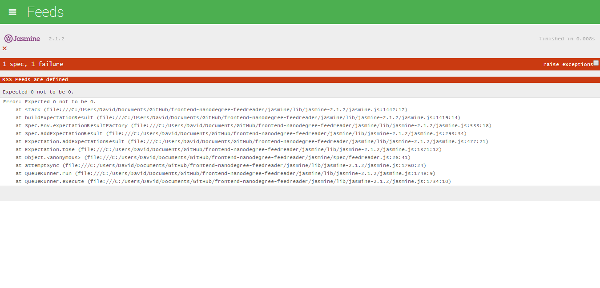

# Udacity Front End Nanodegree - Project 6
## Feed Reader Testing -  version 1.0
### by David Melhart
============================================

## 1. Intended Funcitonality

The intended functionality of the app is feed reading. The main area displays a list of entries that contain posts from a specified feed.

The name of the feed is displayed in the header area.

Left to the title, a hamburger menu icon opens a list menu (opens from left). The menu sevres as a filter between different feeds.

The app runs on the Google Feed Reader API and Handlebars, a javascript templating framework.

The app.js contains the allFeeds variable that, in turn, has all the rss feeds that needed to be displayed on the page.

The loadFeed function is repsponsibe for building the the requited DOM elements and append the HTML to the page.

The $() function is responsible for handing the menu, appending its elements and providing its funcitonality.

## 2. Jasmine Spec Failed Test Window

## 3. After modifying feedreader.js, All Spec Passed Test Window

## Versions: ##

**Version 1.0**
- Initial commit

**To Do List**
- 1. Download the [required project assets](http://github.com/udacity/frontend-nanodegree-feedreader).
- 2. Review the functionality of the application within your browser.
- 3. Explore the application's HTML (*./index.html*), CSS (*./css/style.css*) and JavaScript (*./js/app.js*) to gain an understanding of how it works.
- 4. Explore the Jasmine spec file in *./jasmine/spec/feedreader.js*
- 5. Edit the allFeeds variable in *./js/app.js* to make the provided test fail and see how Jasmine visualizes this failure in your application.
- 6. Return the allFeeds variable to a passing state.
- 7. Write a test that loops through each feed in the allFeeds object and ensures it has a URL defined and that the URL is not empty.
- 8. Write a test that loops through each feed in the allFeeds object and ensures it has a name defined and that the name is not empty.
- 9. Write a new test suite named "The menu".
- 10. Write a test that ensures the menu element is hidden by default. You'll have to analyze the HTML and the CSS to determine how we're performing the hiding/showing of the menu element.
- 11. Write a test that ensures the menu changes visibility when the menu icon is clicked. This test should have two expectations: does the menu display when clicked and does it hide when clicked again.
- 12. Write a test that ensures when the loadFeed function is called and completes its work, there is at least a single .entry element within the .feed container. Remember, loadFeed() is asynchronous so this test wil require the use of Jasmine's beforeEach and asynchronous done() function.
- 13. Write a test that ensures when a new feed is loaded by the loadFeed function that the content actually changes. Remember, loadFeed() is asynchronous.
- 14. When complete - all of your tests should pass.
